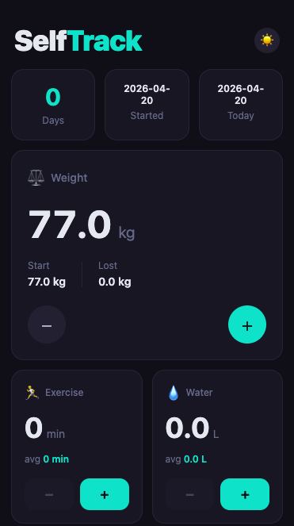

# SelfTrack

SelfTrack is a personal health progress tracker you install on your phone like a native app. Open it daily, log your weight, water intake, exercise minutes, and mood — and it keeps a running average so you can see how you're trending over time.

Everything runs in the browser with no account, no server, and no data leaving your device. All entries are stored locally and available offline.

## Preview

<p align="center">
  
</p>

## Features

- **Weight tracker** — start weight vs current weight, delta in 0.1 kg steps
- **Exercise tracker** — daily minutes, 165-day rolling average
- **Water tracker** — daily intake in 0.1 L steps, cumulative average
- **Mood tracker** — 10-point emoji scale, 90-day average
- **Offline-first** — all data in `localStorage`, works after first load
- **Installable PWA** — add to home screen on iOS and Android

---

## Local Development

### Prerequisites

- Node.js >= 20
- npm >= 10

### Setup

```bash
cp .env.example .env
npm install
node scripts/generate-icons.mjs   # generate placeholder icons once
```

### Start the dev server

```bash
npm run dev
```

Available at http://localhost:5173.

> **Note:** The service worker and install prompt are not active in dev mode.
> To test PWA features (offline support, install prompt, SW caching), use the production preview:

```bash
npm run build && npm run preview
```

### Useful commands

| Command | Description |
|---|---|
| `npm run dev` | Start dev server (hot reload) |
| `npm run build` | Production build |
| `npm run preview` | Serve production build locally |
| `npm run test` | Run tests in watch mode |
| `npm run test:run` | Run tests once (CI) |
| `npm run lint` | Lint source files |
| `npm run format` | Auto-format source files |
| `npx lighthouse http://localhost:4173` | Lighthouse audit against local preview |

---

## Deployment

The app deploys automatically to GitHub Pages on every push to `main` via GitHub Actions.

1. In repository **Settings → Pages**, set source to **GitHub Actions**.
2. Push to `main` — the workflow builds and deploys.

Deployed URL: [https://obaranovskyi.github.io/SelfTrack/](https://obaranovskyi.github.io/SelfTrack/)

> First time? See the step-by-step setup guide: [`conventions/tech/16_github-pages-first-deploy.tech.md`](conventions/tech/16_github-pages-first-deploy.tech.md)

---

## Icons

Placeholder icons (solid indigo squares) are generated by `scripts/generate-icons.mjs`.
Replace the files in `public/icons/` with your final brand assets before release.

Use [maskable.app/editor](https://maskable.app/editor) to verify maskable icon safe zones.

---

## Local Storage Schema

| Key | Type | Description |
|---|---|---|
| `selftrack_startDate` | `string` | ISO date of first open |
| `selftrack_startWeight` | `number` | Initial weight (kg) |
| `selftrack_currentWeight` | `number` | Current weight (kg) |
| `selftrack_exerciseLog` | `object` | `{ "YYYY-MM-DD": minutes }`, last 165 days |
| `selftrack_totalWaterDrunk` | `number` | Cumulative litres since start |
| `selftrack_waterToday` | `object` | `{ date, amount }` — resets each day |
| `selftrack_moodLog` | `object` | `{ "YYYY-MM-DD": 1–10 }`, last 90 days |
